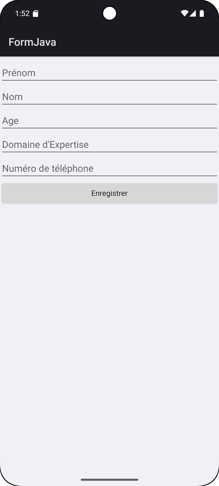
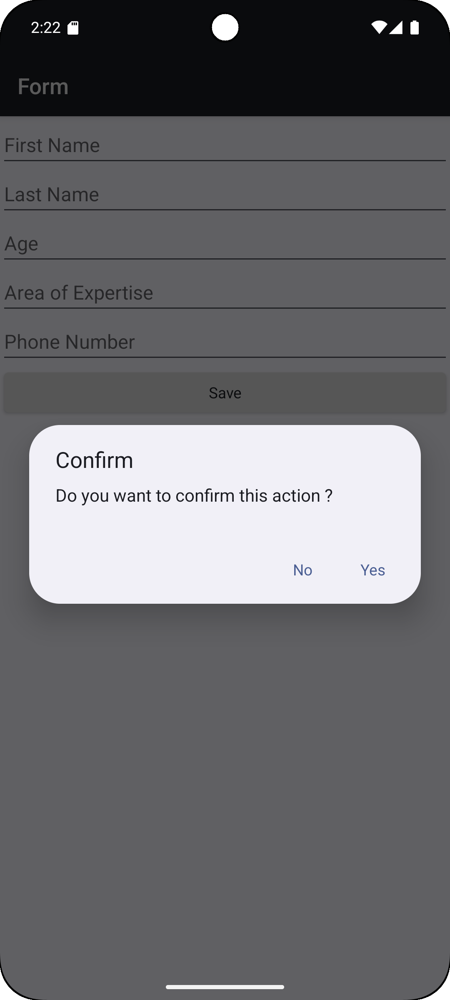
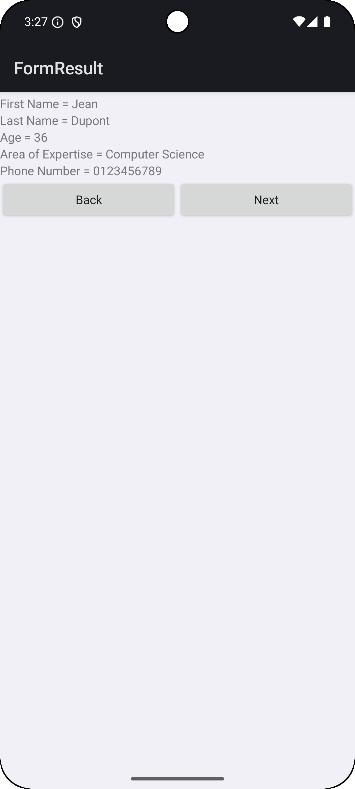
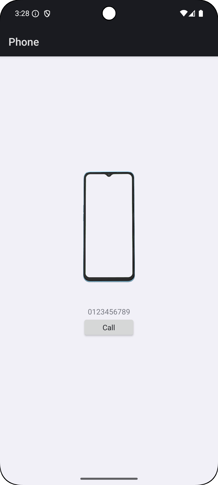
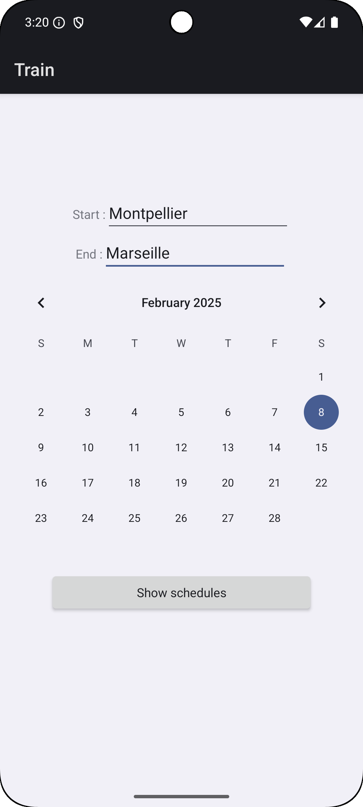
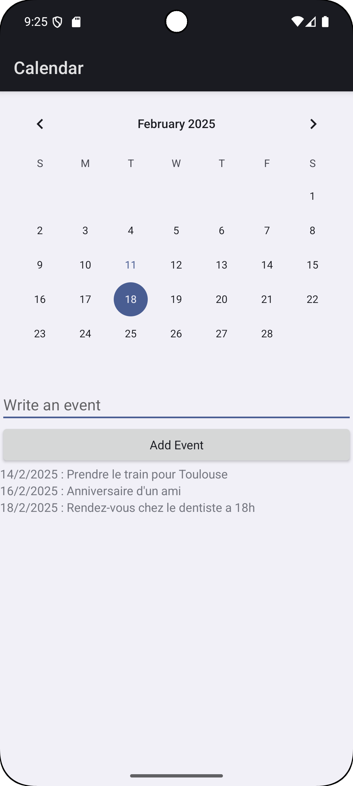

# TP1 : Les Bases d'Android

Hugo SILIVERI

Lien du Git si jamais : 

### Environnement

- Minimum SDK : API 24 (Nougat)
- Appareil utilisé : Pixel 8 API 35 (Android 15)

### Description des fichiers

- `MainActivity.kt` : Activité principale de l'application (page d'accueil pour accéder aux autres activités)
- `HelloWorld.kt` : Affichage du HelloWorld (exercice 2)
- `Form.kt` : Formulaire à remplir en XML (exercice 3, 4 et 5)
- `FormJava.kt` : Formulaire à remplir en Java (exercice 3)
- `FormResult.kt` : Résultat du formulaire XML (exercice 6)
- `Phone.kt` : Interface d'appel téléphonique (exercice 7)
- `Train.kt` : Application de recherche de train (exercice 8)
- `TrainResult.kt` : Résultat de la recherche de train avec les différents trajets (exercice 8)
- `Calendar.kt` : Application de calendrier (exercice 9)

### Exercice 3

### Exercice 4

La capture d'écran est en français car l'application initiale est en anglais. J'ai donc rajouté 
la langue française. Le changement de langue se situe dans `MainActivity.kt` avec la méthode setLocale 
qui est à décommenter dans la méthode onCreate

### Exercice 5

### Exercice 6

Le bouton "Next" ramenait initialement au menu principal

### Exercice 7

### Exercice 8

Les valeurs et le nombre d'itinéaires sont aléatoires donc vous n'aurez pas forcément le même 
affichage que moi 

### Exercice 9

