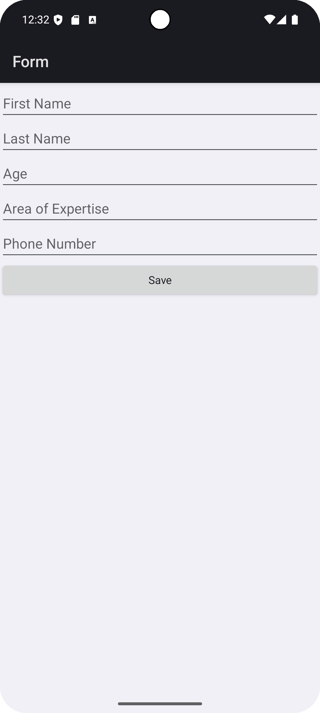
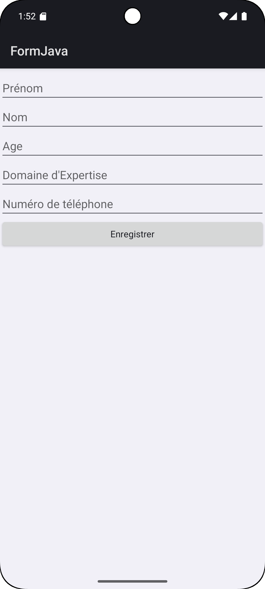
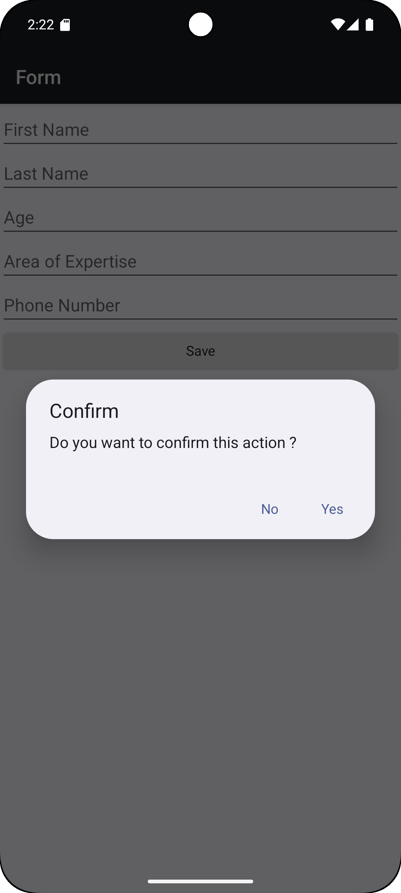
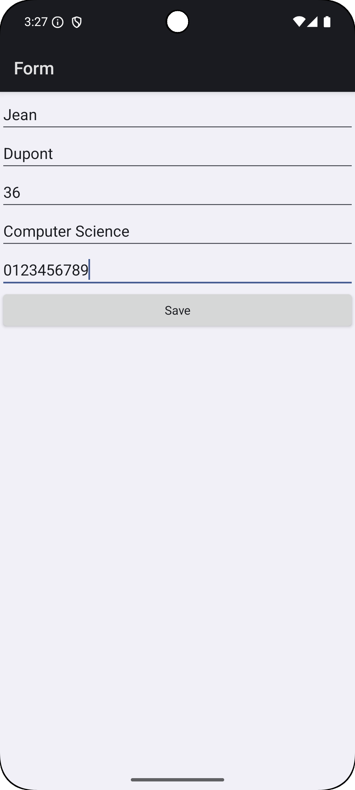
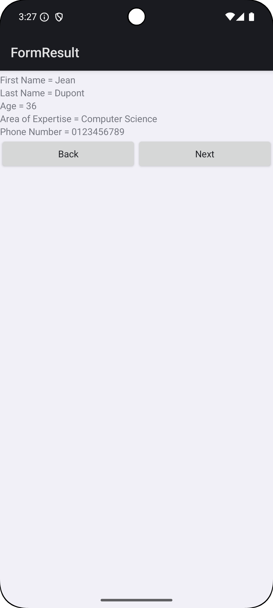
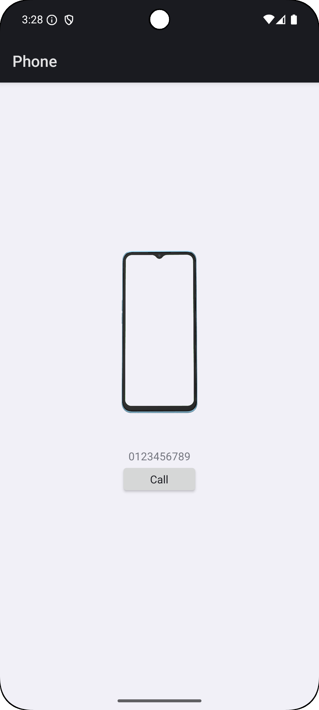
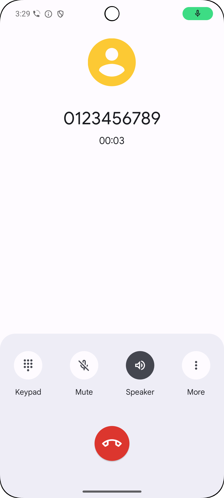
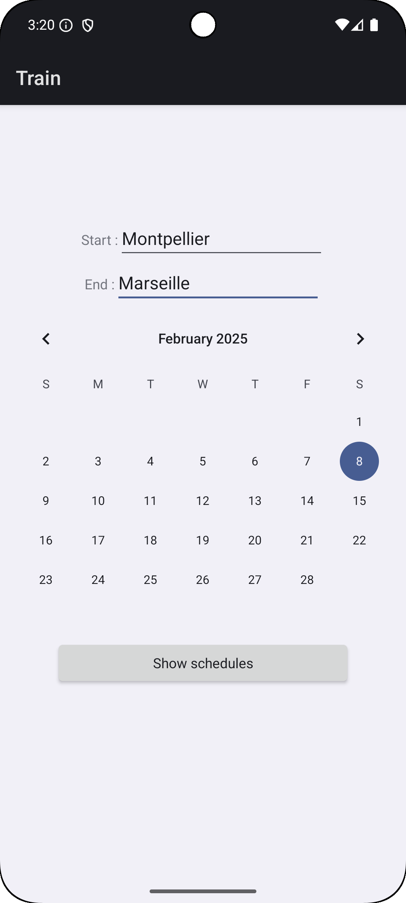
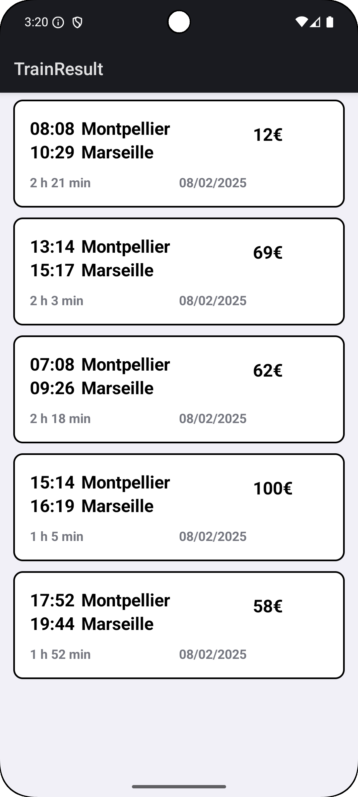

# TP1 : Les Bases d'Android

### Hugo SILIVERI

## Exercice 3

## Exercice 4

La capture d'écran est en français car l'application initiale est en anglais. J'ai donc rajouté 
la langue française

### Exercice 5

### Exercice 6

Le bouton "Next" ramenait initialement au menu principal

### Exercice 7

### Exercice 8

Les valeurs et le nombre d'itinéaires sont aléatoires donc vous n'aurez pas forcément le même 
affichage que moi 

### Exercice 9